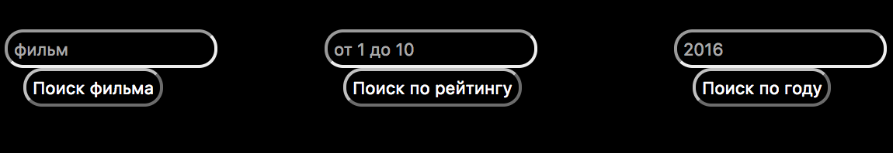

## Проект №1 "Технологии программирования" СГУ-КНиИТ.
## Цель:
	создать веб-сервис для получения данных о фильмах с популярного киносайта гидолнайн.
## Как запустить:

#### Необходимые инструменты:
* [JDK 8+] (http://www.oracle.com/technetwork/java/javase/downloads/jdk8-downloads-2133151.html)

* [IntelliJ IDEA 14+](<https://www.jetbrains.com/idea/download/>)

* [Apache Maven 3+](<https://maven.apache.org/download.cgi>)

#### Скачать zip архив с [проектом](<https://drive.google.com/open?id=0BwQudlf3AtgCQWFQanhycDBLZ28>)
#### Перейти в директорию с проектом и разархивировать его
	к примеру через терминал командой: $ unzip programming\ technology.zip
#### Открыть проект в IntelliJ IDEA и запсутить (Main)
#### Перейти в браузер и вбить в адресной строке: http://localhost:8080/

#### На данном этапе вы можете пользоваться интерфейсом сервиса, который позволит вам искать фильмы по названию либо году, а так же выводить топ фильмов по введенному вами рейтингу в возрастающем или убывающем порядке. При нажатии на любой из найденных фильмов - вы перейдете на сайт для онлайн просмотра выбранного фильма

#### Так же сервис предоставляет возможность получать данные в JSON формате используя GET-запросы вида:
* Поиск по рейтингу:

	http://localhost:8080/gettop?rating=9.5
	
	результатом запроса будут фильмы с рейтингом от 9.5 и выше в формате JSON, отсортированные по убыванию

* Поиск по году:

	http://localhost:8080/getbyear?year=2015
	
	результатом запроса будут фильмы 2015 года в JSON формате

* пример JSON ответа:
	
				{
				"img":"http://gidonline.club/img/9192c0d7b_200x300.jpg",
				"year":"1997",
				"rating":"9.51",
				"href":"http://gidonline.club/2011/08/kontakt/",
				"title":"Контакт"
				}
				где 
				img - это ссылка на обложку фильма
				year - год
				rating - рейтинг
				href - ссылка на просмотр фильма
				title - название

## Сделанно: Студентом СГУ факультета КНиИТ
## Тиркия Гога